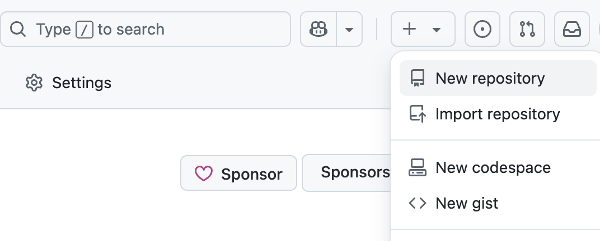
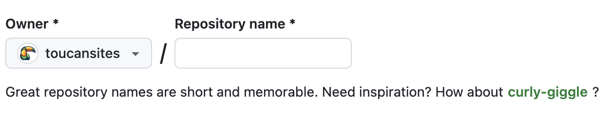
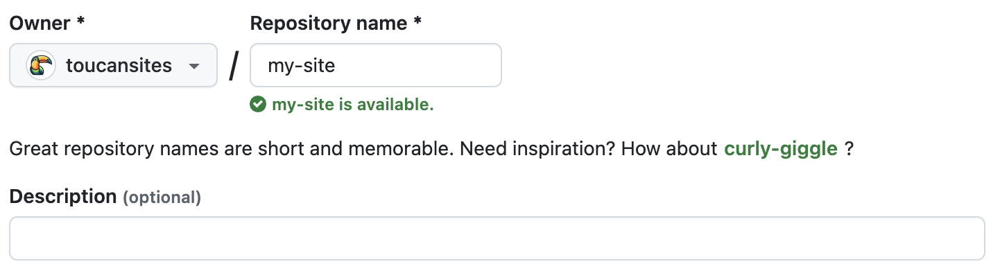
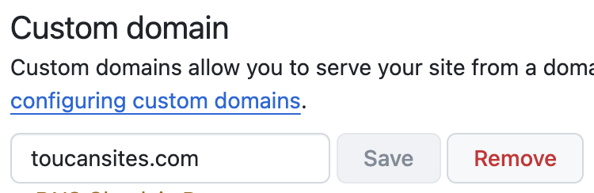

# GitHub Pages


Toucan-based websites can be hosted for free using GitHub Pages. Follow these steps to set up your site.

---

## Setting Up SSH Keys for GitHub Access (If You Don’t Have Keys Already)

If you do not have SSH keys already, you need to create one to securely connect to GitHub repositories. Make sure to use the email address associated with your GitHub account during this process. Here’s how to set it up:

1. Open Terminal:
2. Generate SSH Key:

    ```bash
    ssh-keygen -t ed25519 -C "your_email@example.com"
    ```

    - Replace **your_email@example.com** with the email you use to log into GitHub.
    - Press Enter to accept the default file location.
    - Set a password (optional) or press Enter for none.

3. Add SSH Key to SSH Agent:

    ```bash
    eval "$(ssh-agent -s)"
    ssh-add ~/.ssh/id_ed25519
    ```

4. Copy SSH Key:

    ```bash
    cat ~/.ssh/id_ed25519.pub
    ```

    - Copy the output (this is your public SSH key).

5. Add SSH Key to GitHub:
    - Go to **GitHub > Settings > SSH and GPG Keys**.
    - Click **New SSH Key**, give it a title, paste your copied **SSH key**, and click **Add SSH Key**.

6. Test the Connection:

    ```bash
    ssh -T git@github.com
    ```

    - If everything is set up correctly, you’ll see a message like:

    ```text
    Hi username! You've successfully authenticated, but GitHub does not provide shell access.
    ```

You’re now ready to clone, pull, and push repositories using SSH!

---

## Creating a repository for your site

You can either create a repository or choose an existing repository for your site.

If you want to create a GitHub Pages site for a repository where not all of the files in the repository are related to the site, you will be able to configure a publishing source for your site. For example, you can have a dedicated branch and folder to hold your site source files, or you can use a custom GitHub Actions workflow to build and deploy your site source files.

If the account that owns the repository uses GitHub Free or GitHub Free for organizations, the repository must be public.

If you want to create a site in an existing repository, skip to the [Creating your site](/github-deploy#creating-your-site) section.

1. In the upper-right corner of any page, select **+** , then click **New repository**.
    

2. Use the Owner dropdown menu to select the account you want to own the repository.
    

    **user**.github.io or **organization**.github.io

3. Type a name for your repository and an optional description. If you're creating a user or organization site, your repository must be named **user.github.io** or **organization.github.io**. If your user or organization name contains uppercase letters, you must lowercase the letters. For more information, see [About GitHub Pages](https://docs.github.com/en/pages/getting-started-with-github-pages/about-github-pages#types-of-github-pages-sites).


4. For the repository visibility, choose **public**. For more information, see [About repositories](https://docs.github.com/en/repositories/creating-and-managing-repositories/about-repositories#about-repository-visibility).

5. Select **Initialize this repository with a README**.

6. Click **Create repository**.

---

## Add content to the repository

1. Clone the Repository locally to your computer, if not already done:

    ```bash
    git clone https://github.com/your-username/your-repository.git
    ```

2. Update base url
    When deploying to GitHub Pages, you need to update the baseUrl field in the configuration file, which is location in **site.yml**:

    ```yaml
    baseUrl: "http://localhost:3000/"
    ```

    Depending on your deployment setup, update baseUrl as follows:
    - GitHub Pages (username/repo path):

        ```yaml
        baseUrl: "https://yourusername.github.io/repository-name/"
        ```

    - Custom Domain (e.g., example.com):

        ```yaml
        baseUrl: "https://example.com/"
        ```

    The **baseUrl** is used to generate correct links across your site. If it points to **localhost**, links may break when your site is live on GitHub Pages. **Always remember to update baseUrl before deploying.**

3. Push all the content to GitHub, add and commit files:

    ```bash
    git add .
    git commit -m "Add generated site content"
    git push origin main
    ```

---

## Creating your site

Before you can create your site, you must have a repository for your site on GitHub. If you're not creating your site in an existing repository, see [Creating a repository for your site](/github-deploy/#creating-a-repository-for-your-site).

1. On GitHub, navigate to your site's repository.

2. Under your repository name, click **Settings**. If you cannot see the **Settings** tab, select the **...** dropdown menu, then click **Settings**.

3. In the **Code and automation** section of the sidebar, click **Pages**.

4. Under Source, select the option **GitHub Actions**.
    

5. Check the published site, GitHub will provide a public URL for your site, such as:

    ```text
    https://your-username.github.io/my-github-page/
    ```

6. Check for the deploy file (optional)
    Check if your repository contains **deploy.yml** file location in **.github/workflow/deploy.yml**. If the file does not exist, copy a deploy.yml file to the same directory structure. Every template contains a **deploy.yml** file.

---

## Managing a custom domain

You can set up or update certain DNS records and your repository settings to point the default domain for your GitHub Pages site to a custom domain.

1. On GitHub, navigate to your site's repository.

2. Under your repository name, click **Settings**. If you cannot see the **Settings** tab, select the **...** dropdown menu, then click **Settings**.

3. In the **Code and automation** section of the sidebar, click **Pages**.

4. Under **Custom domain**, type your custom domain, then click Save. If you are publishing your site from a branch, this will create a commit that adds a **CNAME** file directly to the root of your source branch. If you are publishing your site with a custom GitHub Actions workflow, no **CNAME** file is created, so you need to create one manually (containing only a line of text with your custom domain).
    

5. Navigate to your DNS provider (e.g., Namecheap, GoDaddy, Cloudflare) and update the DNS records.

    For Apex Domains (e.g., example.com), set up an **A** record pointing to GitHub’s IP addresses:

    ```text
    185.199.108.153
    185.199.109.153
    185.199.110.153
    185.199.111.153
    ```

    For Subdomains (e.g., www.example.com), set up a **CNAME** record pointing to:

    ```text
    username.github.io
    ```

    (Replace “username” with your GitHub username)

6. Enforce HTTPS (Optional but Recommended)
    - After DNS propagation (may take a few minutes to 24 hours), go back to GitHub Pages settings.
    - Ensure **Enforce HTTPS** is enabled
